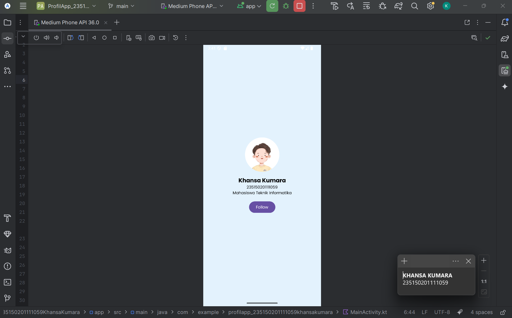
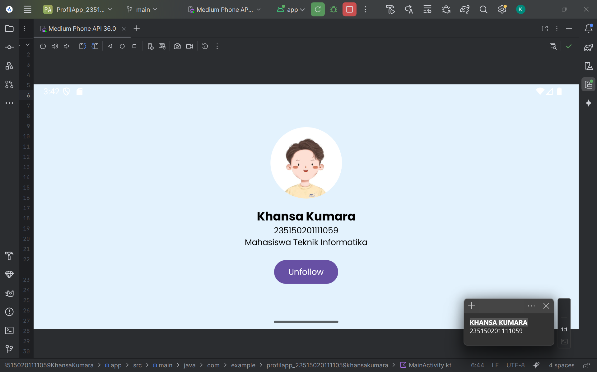

# 📱 PAPB-G-2025 - Praktikum 2 ProfilApp

Project ini dibuat untuk memenuhi tugas **Praktikum 2** mata kuliah **PAPB (Pemrograman Aplikasi Perangkat Bergerak)** Kelas G Tahun 2025.  
Aplikasi ini menampilkan profil sederhana menggunakan **Jetpack Compose**.

---

## ✨ Fitur Utama
- 📸 Menampilkan **foto profil** berbentuk lingkaran  
- 👤 Menampilkan **nama lengkap**, **NIM**, dan **deskripsi singkat**  
- 🔘 Tombol interaktif **Follow / Unfollow** yang berubah otomatis saat ditekan  
- 🎨 Desain menggunakan **Jetpack Compose**, **Material 3**, dan **font custom Poppins**  

---

## 🧩 Struktur Kode Singkat

### 🧠 `MainActivity`
Berisi tampilan utama aplikasi yang diatur dengan **Column** agar elemen tersusun vertikal di tengah layar.  
Menggunakan `Modifier` seperti `fillMaxSize()`, `background()`, dan `padding()` untuk mengatur tata letak.

### 🎨 Font Custom
Menggunakan **FontFamily Poppins** dengan dua varian:  
- `poppins_regular` untuk teks biasa  
- `poppins_bold` untuk teks tebal (nama)

File font disimpan di folder `res/font/`.

### 🔘 `FollowButton`
Composable yang berisi tombol interaktif.  
Menggunakan **state** `remember { mutableStateOf(false) }` untuk menyimpan status Follow.  
Saat tombol ditekan, teks akan berubah secara otomatis dari *Follow* ke *Unfollow*.

---

## 🛠️ Teknologi yang Digunakan
- **Kotlin**
- **Jetpack Compose**
- **Material 3**
- **Custom Font (Poppins)**
- **State Management dengan remember**

---

## 🧠 Analisis Singkat
Jetpack Compose menawarkan cara yang lebih **declarative dan efisien** dibandingkan XML tradisional.  
Pengaturan tampilan menjadi lebih sederhana karena setiap elemen UI ditulis langsung di dalam kode Kotlin.  
Selain itu, perubahan state akan langsung mengubah tampilan tanpa perlu memanggil `findViewById()` atau `notifyDataSetChanged()`.  
Hal ini membuat proses **pengembangan lebih cepat** dan **pemeliharaan kode lebih mudah**.

---

## 🖼️ Screenshot

Tampilan aplikasi ProfilApp:

| Mode Portrait | Mode Landscape |
|---------------|----------------|
|  |  |

---

## 🧑‍💻 Author
**Khansa Kumara**  
Teknik Informatika - 2023  
Universitas Brawijaya

---

© 2025 | Project Praktikum untuk Pembelajaran Jetpack Compose